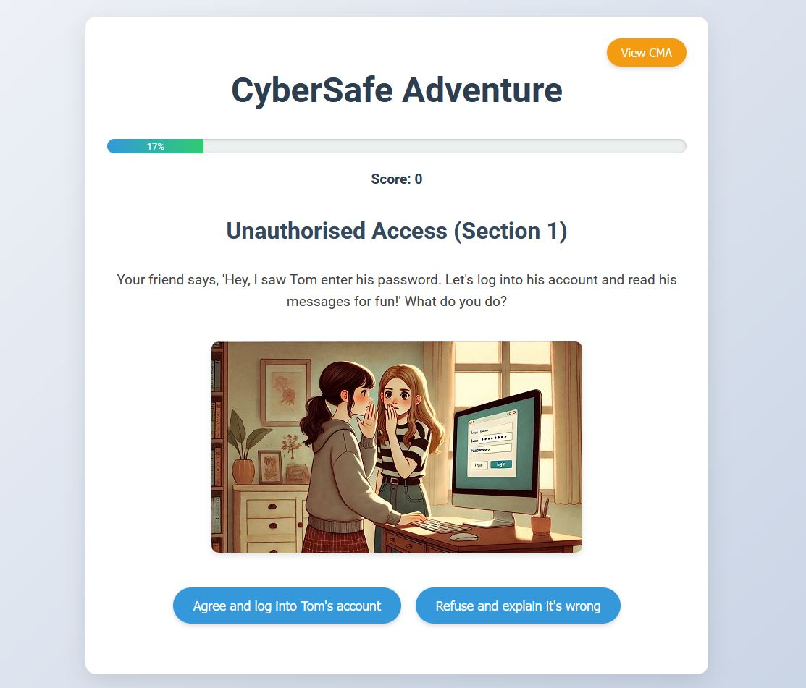

# CyberSafe

CyberSafe Adventure helps you learn about the Computer Misuse Act 1990 through an engaging and interactive experience.



## Table of Contents
- [Introduction](#introduction)
- [Features](#features)
- [Installation](#installation)
- [Usage](#usage)


## Introduction
CyberSafe is designed to educate users on the Computer Misuse Act 1990. The project uses interactive elements to make learning about cyber laws engaging and informative.

## Features
- Interactive scenarios to understand the Computer Misuse Act 1990
- User-friendly interface
- Educational content on various cyber offenses

## Installation
To install CyberSafe, follow these steps:

1. Clone the repository:
    ```sh
    git clone https://github.com/dwain-barnes/CyberSafe.git
    ```
2. Navigate to the project directory:
    ```sh
    cd CyberSafe
    ```
3. Open `index.html` in your preferred browser.

## Usage
1. Launch the application by opening `index.html`.
2. Follow the interactive scenarios to learn about the Computer Misuse Act 1990.
3. Use the navigation buttons to explore different sections.


